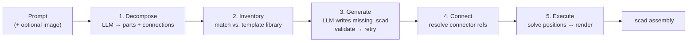

# SCADGen

**Turn natural language into complete, parametric OpenSCAD assemblies.**

SCADGen is an AI-powered CAD generator. Describe an object in plain English — *"make a desk lamp"*, *"build a 4-cylinder engine top end"* — and an agentic pipeline decomposes it into parts, generates any templates it's missing, plans how the parts connect, and emits a ready-to-render `.scad` file.


> A desk lamp generated from the prompt *"make a desk lamp"* — base, gooseneck arm, and shade, each a separate parametric part, positioned by the assembly solver.

> 

> A simple 2 piston Engine from the prompt: *"make a simple 2 piston engine*" — engine block, flywheel, gasket, and pistons (inside block) all positioned by the assembly solver

> 

> A birdcage from the prompt *"a birdcage with a domed top and vertical bars"* — no birdcage template existed; the dome was written from scratch by the LLM, OpenSCAD-verified, and assembled with a base, radial bars, a ring, and a finial. See [`examples/birdcage.scad`](examples/birdcage.scad).

---

## Why this exists

Parametric CAD is powerful but slow to author: you pick parts, set dimensions, name mounting points, and hand-position everything. SCADGen's goal is to do that end-to-end from a description — the way an engineer would sketch an assembly, but automated. The north star: *given a prompt, produce a complete multi-part assembly in OpenSCAD without human intervention.*

The engine assembly is the proving ground; the architecture is general-purpose — lamps, mechanical assemblies, and novel objects all flow through the same pipeline.

---

## How it works

A five-stage agentic pipeline turns a prompt into an assembly:



1. **Decompose** — an LLM breaks the description into parts (with suggested templates, parameters, colors, connections), classifying each as a bare primitive, a *pattern* of repeated elements (e.g. cage bars arranged radially), or a genuinely novel shape that needs to be generated. Optionally guided by a reference image (vision).
2. **Inventory** — each part is matched against the template library by id, alias, or keyword. Parts flagged as novel are routed to generation rather than forced onto the nearest primitive.
3. **Generate** — for anything missing, the LLM writes a complete `.scad` template (with metadata and connectors), which is checked structurally *and* by actually rendering it in OpenSCAD — repairing and retrying up to 3 times until it's real, renderable geometry.
4. **Connect** — connector references are validated against real templates and auto-repaired.
5. **Execute** — a graph solver computes each part's world transform (including repeated/patterned parts) and renders the final `.scad`.

### Built to not fall over

Every stage degrades gracefully instead of crashing — the pipeline is designed to always produce a valid assembly:

- **Out-of-range parameters** are clamped to each template's limits
- **Constraint violations** trigger a retry with safe defaults
- **Bad connector names** are auto-snapped, LLM-refined, or dropped
- **Degenerate geometry** (parts overlapping or below the base) falls back to a deterministic vertical stack
- **Bogus template names / failed generations / orphaned parts** are dropped with warnings, and the rest of the assembly still builds
- **Generated templates that don't actually render** (undefined variables, no geometry, broken syntax) are caught by rendering them in real OpenSCAD — not just checking their text — and sent back for repair

---

## Engineering knowledge, not just geometry

SCADGen isn't a dumb shape printer — templates carry real engineering metadata:

- **Constraints** — geometric rules checked before rendering (e.g. *"bolt circle must clear the outer edge"*, *"outer diameter must exceed inner diameter"*)
- **Standards resolution** — natural-language specs resolve to real values: `"M8 bolt"` → ISO metric thread geometry; `"32-tooth module-2 gear"` → computed pitch/outer diameters
- **Parameter harmonization** — linked dimensions stay consistent (a cylinder head's bore matches its block's)
- **Connectors** — named, expression-driven attachment points (`origin: [0, 0, "height"]`) that let parts mate and stack correctly

## Template library — 28 parametric parts

| Category | Templates |
|---|---|
| **Primitives** | cube, cylinder, sphere, cone, torus |
| **Fasteners** | hex_bolt, hex_nut, washer, set_screw, socket_head_cap_screw, countersunk_screw |
| **Mechanical** | shaft, bushing, bearing_shell, gear_spur, pulley, spring_compression |
| **Engine** | cylinder_block, cylinder_head, piston, connecting_rod, valve, flywheel, oil_pan |
| **Lamp** | lamp_base, lamp_arm, lamp_shade |
| **Sealing** | gasket |

---

## Quickstart


```bash
# install
pip install -e .

# set up an LLM provider (any one):
#   • local:  run Ollama (auto-detected)
#   • cloud:  export ANTHROPIC_API_KEY=...   or   OPENAI_API_KEY=...

# generate a single part
scadgen generate "M8 hex bolt 40mm long" -o bolt.scad

# generate a full assembly from a description
scadgen assemble "make a desk lamp" -o lamp.scad --verbose

# guide the assembly with a reference image (vision models)
scadgen assemble "a birdcage" --image cage.png -o cage.scad

# preview the plan without generating
scadgen assemble "a 4-cylinder engine top end" --dry-run
```

Open the resulting `.scad` in [OpenSCAD](https://openscad.org/) to render, tweak parameters live, or export to STL for printing.

### Providers

Auto-detection order is **Ollama → Anthropic → OpenAI**; when a reference image is supplied, a vision-capable provider is preferred. Force one with `--provider {ollama,anthropic,openai}`.

---

## Architecture

```
scadgen/
├── agentic/      # the 5-stage assembly pipeline (decompose → execute)
├── assembly/     # connector model, position solver, renderer, builder
├── knowledge/    # constraints, standards resolution, harmonization
├── nlp/          # LLM providers (Ollama / Anthropic / OpenAI), extraction
├── core/         # engine + template registry
└── templates/    # 28 parametric .scad templates with metadata
```

- **~6,000 lines of Python**, **366 tests**
- Templates are plain `.scad` files with a `SCADGEN_META` YAML header — add a new part by dropping in a file; no code changes
- LLM-agnostic: swap providers via config or `--provider`

---

## Current status & roadmap

SCADGen has a **robust, working pipeline** — it reliably produces valid, correctly-positioned assemblies and never crashes on bad model output. Genuinely novel objects with no matching template (a birdcage with a domed lattice top) are now decomposed, generated from scratch, and OpenSCAD-render-verified end to end — see [`examples/birdcage.scad`](examples/birdcage.scad).

Known limitations, honestly:

- **Generation fidelity varies with model capability** — a frontier model (Claude, GPT-4o) reliably produces real, structured geometry for novel parts; smaller local models tend to fall back to plain primitives instead of using the pattern/custom-generation machinery
- **No feedback loop** — the system verifies that generated geometry *renders*, but doesn't yet look at *what* it rendered to critique and improve it
- **No persistence** — generated templates aren't carried forward into the library across runs, so the same novel object is regenerated from scratch each time

Planned next steps:

- [ ] Render → vision-critique → regenerate loop (compare the actual render against the request/reference image)
- [ ] Persist generated templates into the library across runs
- [ ] Push decomposition further toward generation on weaker/local models
- [ ] Final-assembly render-check, not just per-template

---

## Tech stack

Python 3.10+ · OpenSCAD · Ollama / Anthropic / OpenAI · PyYAML · pytest

## License

MIT — see [LICENSE](LICENSE).
